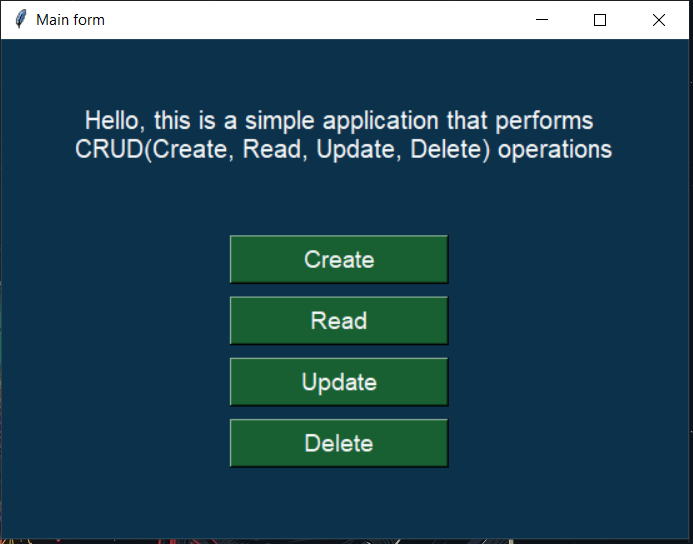
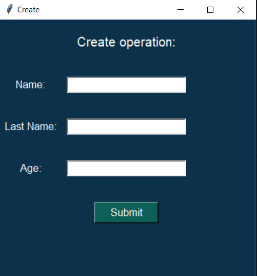
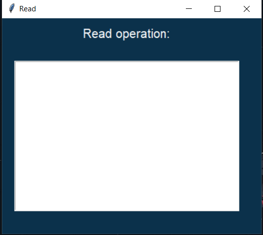
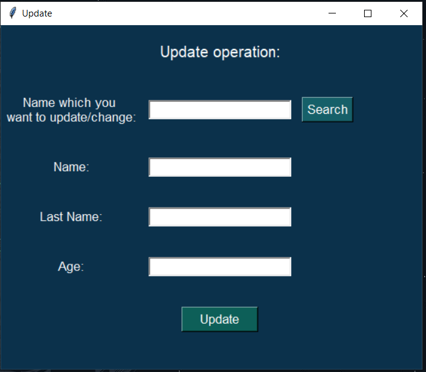
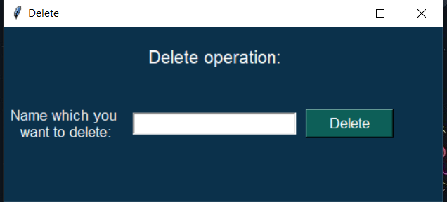

# CRUD Application
This program is a basic CRUD (Create, Read, Update, Delete) application built using Python and Tkinter GUI toolkit. It performs various operations related to a MongoDB database.

## Dependencies
- pymongo (version 3.11.4 or above)
- Tkinter (comes pre-installed with Python)

## How to run
1. Clone the repository to your local machine.
2. Install the required dependencies.
3. Ensure that your MongoDB server is up and running.
4. Run the program by executing the following command: python main.py.
5. Click on the respective button to perform the desired operation.

## Functionality
The program performs the following functions when a button is clicked:

- Create: Inserts the data entered by the user (i.e., first name, last name, and year) into the MongoDB database.
- Read: Retrieves and displays the records present in the MongoDB database.
- Update: Updates the record selected by the user with the new data entered.
- Delete: Deletes the record selected by the user from the MongoDB database.

## The app looks like this:

### Main form:

### Create:

### Read:

### Update:

### Delete:
